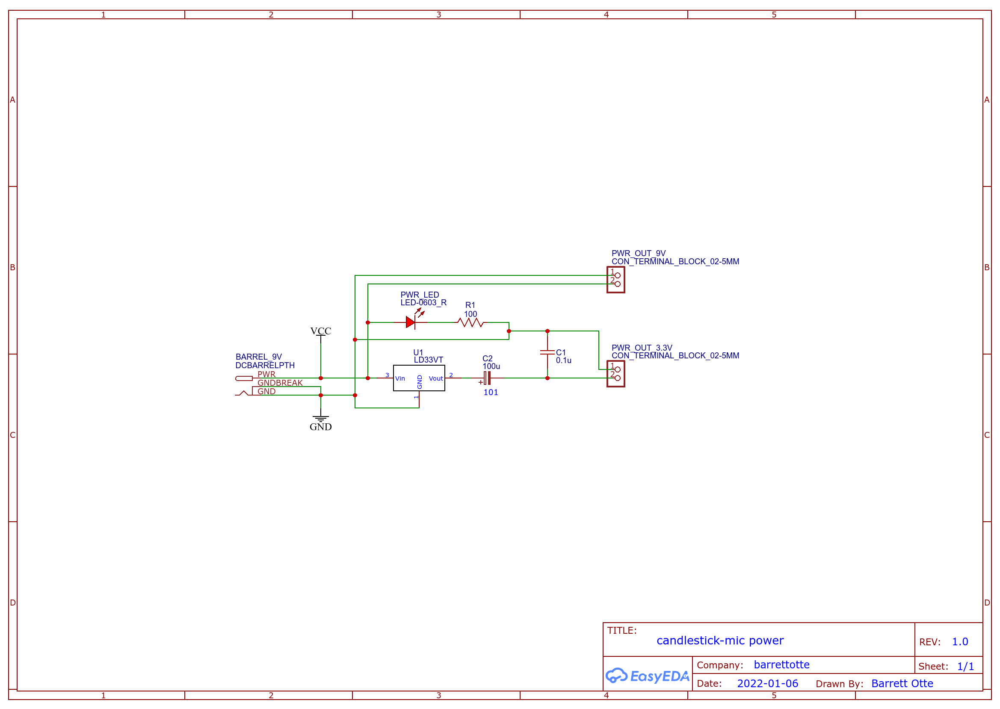

# candlestick-mic

Repairing an old candlestick phone to be used as a headset.

I only did this because I wanted to see if this was possible 
and I wanted to hear what it would sound like in Discord.

Test recording located at [assets/recording.wav](assets/recording.wav) (spoiler it just sounds like an intercom).

## Project Summary

A brief summary of what I did in this project.

### How Does This Phone Work?

I jumped into this not knowing anything really. So I had to figure out how the phone worked on a basic level.

To start the research, I think I have what is referred to as a Kellogg F9 Candlestick (according to [this telephone collecting site](http://www.telephonecollecting.org/Bobs%20phones/Pages/Kellogg/KelloggPhones.htm)). As far as age, I think it was made in 1935 based on a little signature with the date 2/25/35.
My phone also came with a Western Electric oak ringer box [magneto](https://en.wikipedia.org/wiki/Telephone_magneto), but I won't be using it for this project.

Phones of this era used a [carbon microphone](https://en.wikipedia.org/wiki/Carbon_microphone). 
I found a couple good resources for learning how these work:

- [How to Build a Simple Carbon Microphone](https://www.youtube.com/watch?v=XiAzdxDpwJY)
- [The Boys' First Book of Radio and Electronics (1954) pages 200-202](https://worldradiohistory.com/BOOKSHELF-ARH/Technology/The-Boy%27s-First-Book-of-Radio-Morgan-1954.pdf)
- [Principles of Electricity Applied to Telephone and Telegraph Work (1938) pages 66-68](https://www.amazon.com/Principles-Electricity-Applied-Telephone-Telegraph/dp/B000Q75WQE) - A VERY in depth book about telegraphy and telephony of this era.

For determining what the rest of the phone was supposed to do, I primarily used [telephonecollectors.info](https://www.telephonecollectors.info/strombergcarlson/kellogg/kellogg_main.htm).
Here is a list of old resources I got to skim through:

- [Kellogg Patent Collection 1890-1916](https://www.telephonecollectors.info/strombergcarlson/kellogg/PDF/PATENTS_KELLOGG_ASSIGN.pdf)
- [Kellogg Bulletin 8 - Magneto Telephones 1903](https://www.telephonecollectors.info/strombergcarlson/kellogg/PDF/1903_BLTN_8_MAG_TEL_SETS.pdf)
- [Kellogg Bulletin 38 - Magneto Telephones 1909](https://www.telephonecollectors.info/strombergcarlson/kellogg/PDF/1909_BLTN_38_MAG_TEL_SETS.pdf)
- [Transmitter Wiring #229](docs/229c_tl.pdf) and [Transmitter Wiring #323](docs/323_tl.pdf)
- [Kellogg Wiring Diagrams](https://www.telephonecollectors.info/strombergcarlson/kellogg/PDF/DIAGRAMS.pdf)
- [Telephone Archive - Kellogg](http://www.telephonearchive.com/phones/index.html)
- Supply voltage ended up being two of these [1.5v dry cells](https://collection.maas.museum/object/214017) in series. I ended up bumping it up to 3.3v for simplicity.

I also downloaded the resources I used and put them in [docs/](docs/) so they never get lost if that site goes down.

### Repairs

I removed all the magneto connections and old frayed cloth cable. I bought a new cloth cable and re-wired the phone how I needed it.

Surprisingly, the only thing I actually had to repair was a few broken solder joints in the receiver and transmitter. 
I was able to fairly quickly supply voltage and see my voice show up on my oscilloscope...albeit as a very low signal.

### The Rest

The secondary goal of this project was to use all the original phone hardware. I also wanted to make this easily removable just in case I want to actually
hook this phone up to a landline one day.

For some reason I thought I was going to need to build some DAC (digital to analog conversion) and ADC (analog to digital conversion) circuits to get this working.
So, I found the following resources:

- https://wiki.analog.com/university/courses/electronics/text/chapter-20
- [Digital Audio Fundamentals](https://www.youtube.com/playlist?list=PLbqhA-NKGP6B6V_AiS-jbvSzdd7nbwwCw)

But duh, of course a computer's sound card/front panel take care of converting signals for you.

Since the phone signal was so low, that calls for an amplifier. I'm still an electronics beginner so I used [this page](https://www.circuitbasics.com/build-a-great-sounding-audio-amplifier-with-bass-boost-from-the-lm386/) as a basis, which uses an [LM386 Low Voltage Audio Power Amplifier](https://www.ti.com/lit/ds/symlink/lm386.pdf).

After implementing that, I just had to play around with various capacitors to eliminate additional noise that was causing insane buzzing/humming.
Again, I don't know what I'm doing so I just did trial and error.

To finish the project I finalized my circuit, soldered it to protoboard, and designed/3D printed an enclosure.

To use it, I just plug in the headphone and microphone jack to the front panel of my computer.

## Circuit

I wasn't ready to actually design and order a full PCB for this. But, I put together some basic
circuits on [EasyEDA](https://easyeda.com/). Exported circuit images can be found in [eda/](eda/).

## Component List

I'm still not experienced enough to put together proper EDA/CAD with a BOM, but here are the
components I used.

- 1 x six position dual row screw terminal block
- 4 x two position screw terminal
- 8 x M2x8 machine screws
- 2 x M4x10 machine screws
- 2 x 3.5mm mini stereo female socket
- 1 x 2.1mm barrel jack
- 1 x red LED
- 1 x toggle switch
- 1 x LM386 IC
- 1 x DIP-8 socket
- 1 x LD1117V33 voltage regulator
- 2 x 10KΩ potentiometers
- 1 x 10KΩ resistor
- 1 x 100Ω resistor
- 1 x 10Ω resistor
- 1 x 0.047μF ceramic capacitor
- 2 x 0.1μF ceramic capacitor
- 1 x 0.01μF ceramic capacitor
- 1 x 1000μF electrolytic capacitor
- 1 x 100μF electrolytic capacitor
- 2 x 10μF electrolytic capacitor

## References

Listed above in individual sections.
